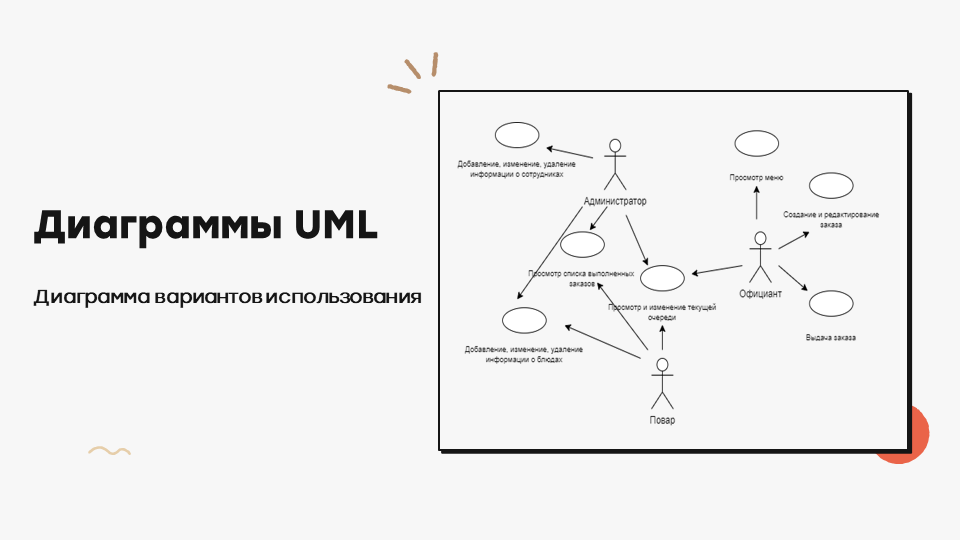

# Программа предназначена для автоматизации процесса приема заказов и обеспечение более эффективной работы сотрудников ресторана 
Данный программный продукт предоставляет следующие основные функции: 
 
**Создание заказа:**
<ul>
	<li>добавление блюд;</li>
	<li>выбор номера столика;</li>
	<li>указание места приема блюд;</li>
</ul>

**Блюда:**
<ul>
  <li>добавление новых блюд;</li>
  <li>удаление блюд;</li>
  <li>редактирование блюд;</li>
</ul>

**Сотрудники:**
<ul>
	<li>добавление новых сотрудников;</li>
	<li>удаление сотрудников;</li>	
</ul>

**Специальные возможности:**
<ul>
	<li>возможность отправки любой информации на электронную почту.</li>
</ul>
 

# The program is designed to automate the process of taking orders and ensure more efficient work of restaurant employees.

This software product provides the following key features:

**Order Creation:**
<ul>
  <li>adding dishes;</li>
  <li>selecting a table number;</li>
  <li>specifying the place of dish reception;</li>
</ul>

**Dishes:**
<ul>
  <li>adding new dishes;</li>
  <li>deleting dishes;</li>
  <li>editing dishes;</li>
</ul>

**Employees:**
<ul>
  <li>adding new employees;</li>
  <li>deleting employees;</li>
</ul>

**Special Features:**
<ul>
  <li>ability to send any information via email.</li>
</ul>
 

 

 

 

 

 

